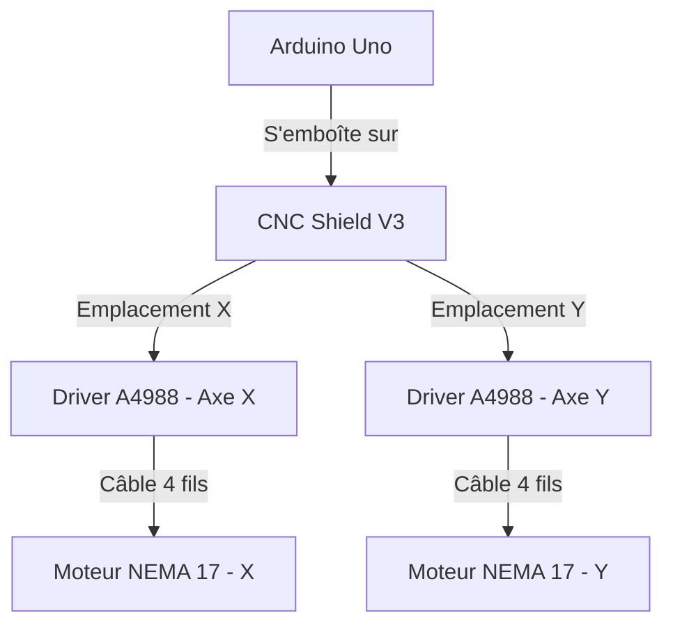
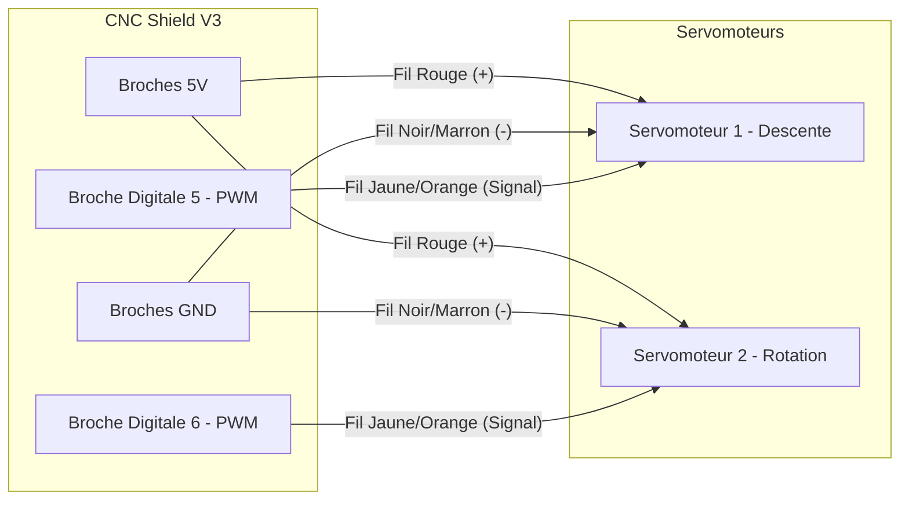
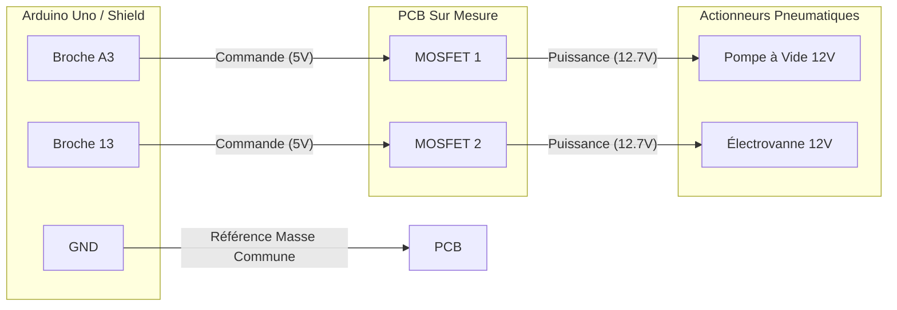
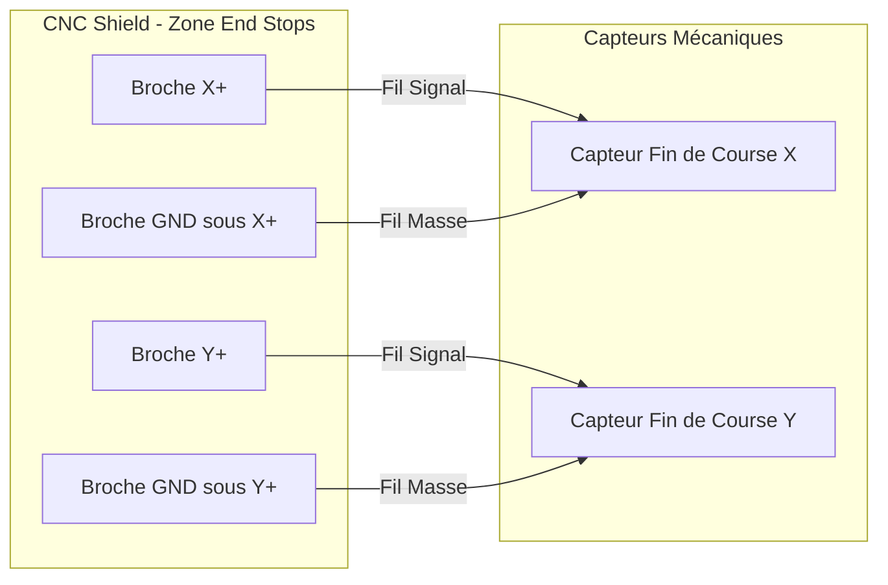

# Conception et prototypage

# I.Conception électronique 

## Câblage et Connexions Électriques

Cette section détaille le branchement de chaque composant, fil par fil, pour permettre de reproduire l'électronique du robot à l'identique.


### 1. Alimentation et Arrêt d'Urgence
Toute la puissance mécanique du robot dépend de la batterie 12,7 V. L'objectif est de pouvoir tout couper d'un seul coup.

* **L'Arrêt d'urgence :** Il est placé en "série" sur le fil positif. 
  * Le fil Rouge (+) provenant de la batterie se branche sur l'entrée du bouton coup de poing.
  * En sortie du bouton, le fil Rouge (+) se divise en deux : un câble part vers le bornier d'alimentation du CNC Shield, et l'autre part vers le bornier d'alimentation de notre carte sur mesure (PCB).
* **La Masse :** Le fil Noir (-) de la batterie est directement relié aux borniers "GND" du CNC Shield et de la carte sur mesure.
* **L'Arduino :** Il est alimenté séparément avec son câble USB classique branché à l'ordinateur (qui fournit le 5 V de sécurité).
  
```html
<div class="mermaid">
graph TD
    subgraph Énergie Puissance
        B[Batterie 12.7V]
    end
    
    subgraph Sécurité
        AU((Bouton Arrêt <br> d'Urgence))
    end
    
    subgraph Cartes Électroniques
        CNC[Bornier CNC Shield]
        PCB[Bornier PCB Pompe]
    end

    B -- "Fil Rouge (+)" --> AU
    AU -- "Fil Rouge (+)" --> CNC
    AU -- "Fil Rouge (+)" --> PCB
    B -- "Fil Noir (-)" --> CNC
    B -- "Fil Noir (-)" --> PCB
</div>

### 2. Le Cerveau : Arduino et CNC Shield
Le branchement principal est le plus simple : la carte d'extension **CNC Shield v3** vient simplement s'emboîter directement sur le dessus de la carte **Arduino Uno**. Il faut juste vérifier que toutes les petites broches en métal rentrent bien dans les trous noirs de l'Arduino sans se tordre.

### 3. Les Moteurs de déplacement (Axes X et Y)
Ce sont les gros moteurs (NEMA 17) qui font bouger le robot sur la table.

* **Les Drivers (A4988) :** On enfonce ces petits modules sur les emplacements marqués `X` et `Y` au centre du CNC Shield. *(Attention à mettre la petite vis de réglage du bon côté selon la documentation du module !)*
* **Les Moteurs :** Chaque moteur possède un câble avec un connecteur à 4 fils (les deux bobines internes). Ils viennent se brancher directement sur les 4 petites broches alignées juste à côté de leur driver A4988 respectif. Notez à inverser les deux fils du milieu.


### 4. La Tête de Préhension (Les 2 Servomoteurs)
Les deux servomoteurs (MG996R) qui gèrent la descente et la rotation de la ventouse possèdent 3 fils chacun :

* **Fil Rouge (Énergie) :** À brancher sur une broche **5V** libre du CNC Shield.
* **Fil Marron ou Noir (Masse) :** À brancher sur une broche **GND** du CNC Shield.
* **Fil Jaune ou Orange (Signal) :** C'est le fil qui transporte les ordres. Puisque les broches classiques sont déjà utilisées, on les branche sur des broches libres capables de faire varier la tension (PWM). Par exemple, le premier sur la broche **5** et le deuxième sur la broche **6**.


### 5. L'Aspiration (La carte sur mesure / PCB)
C'est la carte qui fait l'intermédiaire avec le 12,7 V pour gérer la pneumatique.

* **Les Actionneurs :** * Les 2 fils de la **Pompe à vide** se vissent dans le bornier de sortie (souvent appelé "M1" sur la carte).
  * Les 2 fils de l'**Électrovanne** se vissent dans l'autre bornier de sortie ("M2").
* **La Commande depuis l'Arduino :** On utilise 3 petits fils pour relier cette carte à l'Arduino :
  * Le fil de référence (GND) du PCB se branche sur une broche **GND** libre du Shield.
  * Le fil qui commande l'allumage de la **pompe** est branché sur la broche **A3** (broche analogique de l'Arduino).
  * Le fil qui commande l'ouverture de la **vanne** est branché sur la broche **A4** (broche analogique de l'Arduino).


### 6. Les Sécurités (Capteurs de fin de course)
Ce sont les interrupteurs qui disent au robot quand il touche les bords de la table. Ils n'ont que 2 fils (connectés sur les pattes "Normalement Ouvert" et "Commun" de l'interrupteur).

* **Capteur de l'axe X :** Les deux fils se branchent sur la zone "End Stops" du CNC Shield. Un fil sur la broche **X+** et l'autre sur la broche **GND** située juste en dessous. *(En code, cela correspond à la broche 9)*.
* **Capteur de l'axe Y :** Un fil sur la broche **Y+** et l'autre sur le **GND** correspondant. *(En code, cela correspond à la broche 10)*.


# II.Conception mecanique 

# III. programmation  

<script src="[https://cdn.jsdelivr.net/npm/mermaid@9.4.3/dist/mermaid.min.js](https://cdn.jsdelivr.net/npm/mermaid@9.4.3/dist/mermaid.min.js)"></script>
<script>mermaid.initialize({startOnLoad:true});</script>
